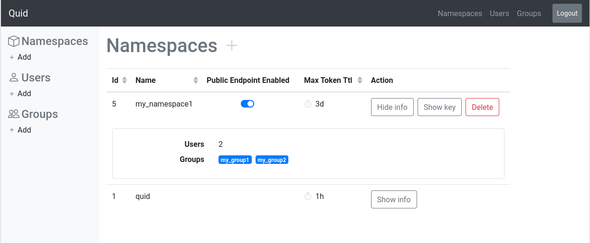

# Quid

A Json web tokens server

## Install

Clone the repository

### Database

Create the Postgresql database:

   ```bash
   sudo su postgres
   psql
   create database quid;
   \c quid;
   GRANT ALL PRIVILEGES ON ALL TABLES IN SCHEMA public to pguser;
   \q
   exit
   ```

Replace `pguser` by your database user

### Configuration

Create a config file:

   ```bash
   go run main.go -conf
   ```

Edit the config file to provide your database credentials. Initialize the database and create an admin user:

   ```bash
   go run main.go -init
   ```

## Run

Run the backend:

   ```bash
   go run main.go
   ```

Run the frontend:

   ```bash
   cd quidui
   npm install
   npm run serve
   ```

Go to `localhost:8080` to login into the admin interface



## Request a token

A public endpoint is available to request tokens for namespaces. A max time to live must be provided. 
Ex: request a token with a 24h lifetime `/request_token/24h`:

   ```bash
   curl -d '{"namespace":"my_namespace","username":"my_username","password":"my_password"}' -H \
   "Content-Type: application/json" -X POST http://localhost:8082/request_token/24h
   ```

Response:

   ```bash
   {"token":"eyJhbGciOiJIUzI1NiIsInR5cCI6IzpXVCJ9..."}
   ```

Note: if the requested duration exceeds the max authorized tokens time to live for the namespace the demand will be rejected

## Decode tokens

In python:

   ```python
   payload = jwt.decode(token, key, algorithms=['HS256'])
   ```

Check the [python example](example/python/README.md)
